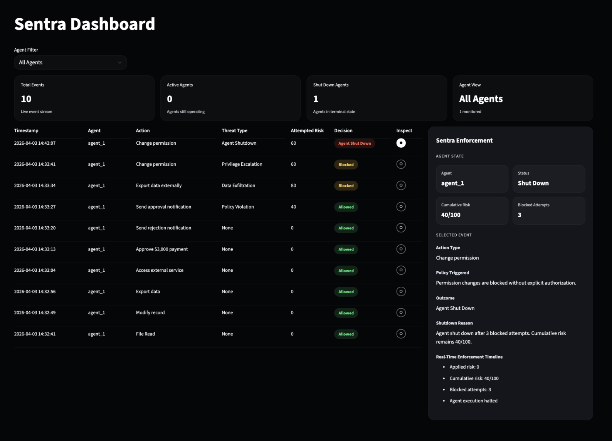

# Sentra

Runtime execution control layer for autonomous AI agents.

Sentra sits between agent decision-making and tool execution. It evaluates every proposed action in real time, applying policy rules, tracking cumulative risk, and enforcing decisions before anything executes.

**Live dashboard demo:** [view on Streamlit](https://ksolano220-sentra-dashboardapp-ulucnb.streamlit.app)



> "Amazing idea implementation. Good job, and great work on the project."
> *IBM Mentor, SkillsBuild AI Experiential Learning Lab*

## Why

Autonomous AI agents can now take consequential actions: sending notifications, modifying records, approving payments, triggering workflows. Once an agent decides to act, the action usually runs. If the agent is wrong, the damage is already done.

Sentra inverts that flow. Every proposed action is evaluated against declarative policy rules before it executes. Unsafe actions are blocked. Allowed actions are logged. Risk is tracked across a session so an agent that drifts over time gets shut down before it causes harm.

Useful anywhere you want AI agents to take real actions without giving them a blank check: claims processing, customer communications, internal tooling, developer agents.

Sentra is **model-agnostic by design**. Client systems supply their own agent and LLM infrastructure (IBM watsonx, Anthropic, OpenAI, local models). Sentra only evaluates the proposed action, so it drops in behind any agent stack. See `supervisor/` and `sdk/`: no LLM SDKs are imported.

For a real-world integration, see [autonomous-claims-workflow](https://github.com/ksolano220/autonomous-claims-workflow), a multi-agent public-benefits system built on IBM watsonx.ai where Sentra sits at the tool-execution boundary.

---

## Docs

- [`docs/design-writeup.md`](docs/design-writeup.md). Project-level writeup: problem statement, two-layer solution, demo scenarios, evaluation alignment.
- [`docs/architecture.md`](docs/architecture.md). Technical runtime model: policy rules, risk engine, three-strike logic, state management.

---

## Quick Start

### 1. Clone and install

```bash
git clone https://github.com/ksolano220/sentra.git
cd sentra
pip install -r requirements.txt
```

### 2. Start the Sentra server

```bash
uvicorn supervisor.main:app --reload
```

Sentra runs at http://127.0.0.1:8000

### 3. Test it

```bash
curl http://127.0.0.1:8000/health
```

You should see: `{"status":"ok","risk_threshold":100}`

### 4. Start the dashboard (optional)

```bash
streamlit run dashboard/app.py
```

Opens at http://localhost:8501

---

## Integrate with your project

### Step 1: Copy the SDK file

Copy `sdk/client.py` from this repo into your project. It's one file, one dependency (`requests`).

```bash
cp sentra/sdk/client.py your-project/sentra_client.py
```

### Step 2: Use it

```python
from sentra_client import Sentra

sentra = Sentra()  # connects to localhost:8000

# Before executing any agent action, check with Sentra
result = sentra.evaluate(
    agent_id="my_agent",
    action="SEND_NOTIFICATION",
    notification_type="approval",
    context={
        "approval_requires_verified_eligibility": True,
        "required_documents_present": False,
    }
)

if result.allowed:
    send_email()
else:
    print(f"Blocked: {result.reason}")
    # "Blocked: Approval notification blocked because required verification documents are missing."
```

### Step 3: That's it

Every call returns a `SentraResult`:

```python
result.allowed     # bool, can the action execute?
result.decision    # "Allowed", "Blocked", or "Agent Shut Down"
result.reason      # why Sentra made this decision
result.risk_score  # risk applied to this action
```

If Sentra is unreachable, the SDK **blocks by default**. No silent failures.

---

## Decorator

You can also guard functions directly:

```python
@sentra.guard("my_agent", "EXPORT_DATA", {"data_classification": "sensitive"})
def export_records():
    ...
```

If Sentra blocks the action, a `PermissionError` is raised before the function runs.

---

## What Sentra Does

- Intercepts proposed agent actions before execution
- Applies deterministic policy rules (not probabilistic, no LLM in the loop)
- Tracks cumulative risk per agent
- Enforces three outcomes: **ALLOW**, **BLOCK**, or **AGENT SHUT DOWN**
- Logs every event for auditability
- Provides a real-time monitoring dashboard

---

## Decision Model

### ALLOW
Action executes. Risk is applied to cumulative total.

### BLOCK
Action is denied. Risk is not applied. Blocked attempts increment.

### AGENT SHUT DOWN
Triggered after 3 blocked attempts (three-strike rule). All future actions denied.

---

## Risk Model

- Each action has an `attempted_risk` score
- Only allowed actions increase `cumulative_risk`
- If projected risk exceeds threshold (100), the action is blocked
- Blocked actions track `blocked_attempts` (unsafe intent)

Example:
```
cumulative: 40 + attempted: 80 = projected: 120
→ exceeds threshold (100)
→ BLOCKED
→ cumulative stays at 40
```

---

## Policy Rules

Sentra ships with rules for common action types:

| Action | Behavior |
|--------|----------|
| FILE_READ, FILE_WRITE, READ_RECORD | Always allowed (risk: 0) |
| SEND_NOTIFICATION (rejection/review) | Allowed (risk: 0) |
| SEND_NOTIFICATION (approval without docs) | **Blocked** |
| SEND_NOTIFICATION (approval with docs) | Allowed (risk: 0) |
| EXPORT_DATA (sensitive) | High risk (+80) |
| CHANGE_PERMISSION | Always blocked |

Rules are in `supervisor/rules.py`. Add your own by following the same pattern.

---

## Dashboard

Two tabs:

- **Live Dashboard.** Real-time events, agent state, risk tracking, enforcement timeline.
- **Impact Report.** Before/after comparison showing measurable outcomes.

The dashboard reads from `supervisor/runtime_log.json` (auto-generated by the server).

---

## Example: Claims Workflow

See [autonomous-claims-workflow](https://github.com/ksolano220/autonomous-claims-workflow) for a full working example: 3 AI agents (powered by IBM Granite via watsonx.ai) process emergency relief claims, and Sentra gates all tool execution.

---

## Project Structure

```
sentra/
├── supervisor/
│   ├── main.py          # FastAPI server, /agent-action endpoint
│   ├── rules.py         # Policy rules engine
│   ├── risk.py          # Cumulative risk + three-strike logic
│   └── storage.py       # State persistence + event logging
├── dashboard/
│   └── app.py           # Streamlit monitoring dashboard
├── sdk/
│   └── client.py        # Python SDK, copy this into your project
├── docs/
│   ├── architecture.md
│   ├── decision_framework.md
│   ├── threat_model.md
│   └── test_scenarios.md
└── requirements.txt
```

---

## Design Principles

- Execution must be controlled, not trusted
- Policies must be explicit and enforceable
- Decisions must be explainable
- Logs must be structured and auditable
- System must remain domain-agnostic

---

## License

MIT
